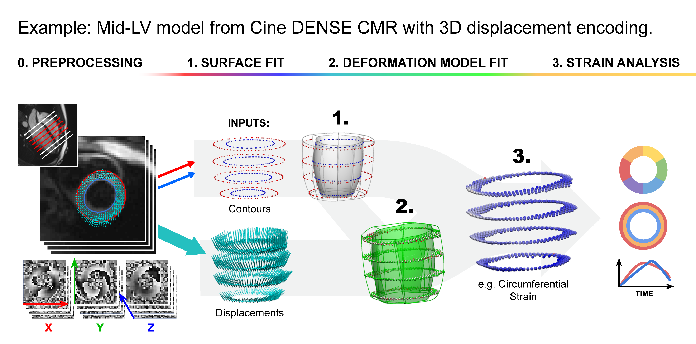

<div align="center">


# mobstr3D
Model-based Strains in 3D


[](https://opensource.org/licenses/Apache-2.0)


<div align="left">

---
# Overview
mobstr3D is an open-source, Python-based (v3.13.2), software package for analysing myocardial motion by reconstructing 3D patient-specific biophysical kinematic models from acquired 3D displacement information.

mobstr3D utilises the finite element mesh representation library [HOMER (High-Order MEsh Reconstructions)](https://github.com/abi-breast-biomechanics-group/HOMER).

**Typical application:** model the left ventricle (LV) from cine balanced 4-pt displacement encoding with stimulated echoes (DENSE) cardiac magnetic resonance (CMR) images


## Features
- DICOMs as input: automated image registration, segmentation, phase unwrapping
- denseanalysis ".mat" files as input: preprocessing
- Model fitting (mid-LV slab)
- Strain analysis

#### WIP Features 🚧
- Extension to full LV model
- Slice correction


<p align="center">
⭐ the repo to stay updated on new releases!
<p>



#### For citation
<blockquote>G. E. Harpur et al., “mobstr3D: Open-Source Software for Analysing Cine DENSE CMR to Quantify Regional Heart Motion and Strain,” Journal of Cardiovascular Magnetic Resonance, vol. 28, p. 102336, Mar. 2026, 

[doi: 10.1016/j.jocmr.2025.102336](https://doi.org/10.1016/j.jocmr.2025.102336). </blockquote>


---
# Table of Contents
- [Overview](#overview)
- [Installation](#installation)
- [Usage](#usage)
- [Examples](#examples)
- [License](#license)
- [Acknowledgements](#acknowledgements)
- [Contact](#contact)
---

# Installation
It is recommended to use a Conda environment for this project.


### 1. Clone the repository
First, [install git](https://git-scm.com/book/en/v2/Getting-Started-Installing-Git) for your operating system, then clone the repository:

```bash
git clone https://github.com/UOA-Heart-Mechanics-Research/mobstr3D.git
```
Alternatively, you can use software such as [GitHub Desktop](https://desktop.github.com/download/) or [GitKraken](https://www.gitkraken.com/) to clone the repository using the repository url.


### 2. Navigate to cloned repository
```bash
cd /path/to/repo/mobstr3D
```

### 3. Create and activate a conda environment
Install [Miniconda](https://www.anaconda.com/docs/getting-started/miniconda/main) if not already installed, then create a new virtual environment using conda:
```bash
conda create --name mobstr3D python=3.13
conda activate mobstr3D
```

### 4. Install dependencies
```bash
pip install -r requirements.txt     #default
```
Or for development purposes, replace with the command below to install mobstr3D in editable mode:
```bash
pip install -e .                    #editable/dev mode
```

### 5. Install HOMER library (git)
```bash
pip install git+https://github.com/abi-breast-biomechanics-group/HOMER.git
```

### 6. Install PyTorch and nnUNetv2 (only required if running DICOM preproccessing)

First, install PyTorch

Find the right PyTorch version for your GPU and OS and [**install it as described on the website**](https://pytorch.org/get-started/locally/).

#### **Do not install nnU-Net without installing PyTorch first!**
#### **If you do, you will need to start over again.**

After PyTorch has been installed, install nnU-Net by entering the following command into your terminal.

```bash
pip install nnunetv2
```

---
# Usage


### 0. Activate conda environment
When making any application of mobstr3D, be sure to activate the conda environment:
```bash
conda activate mobstr3D
```

### 1. Configure
Setup [config.toml](config.toml) according to your application:
- modules to run
- input paths (images and/or data)
- output path
- model parameters
- fitting parameters (e.g. smoothing)
- plotting and debugging flags

For logging purposes, a copy of the config file will be saved in the output folder. 

### 2. Run
```bash
python main.py --config /path/to/config.toml
```

### 3. Analyse strains (optional)
Visualise strains given respective modelling outputs. 

---
# Examples
You can verify that the repository is working by running mobstr3D on the example data.

Example data can be found in:
```bash
/path/to/repo/mobstr3D/data/example
```
The default [config.toml](config.toml) settings allow for fitting.

## Example 1: Mid-Left Ventricle Human
Provided is an example data set for fitting a mid-left ventricular slab model from human data (Distribution approved through ethics reference: UoA Human Participants Ethics Committee 25350)

### a. Unzip the data file
Locate and unzip:
```bash
/path/to/repo/mobstr3D/data/example/example_human_data.zip
```
### b. OPTION: decide preprocessing input - "DICOM" or "denseanalysis"
Both options have been prepared in this example case.
Select preferred option in [config.toml](config.toml)

Default: "DICOM"

Additionally, ensure preprocessing input paths are updated accordingly.

### c. Run main.py
```bash
cd /path/to/repo/mobstr3D
python main.py --config ./config.toml
```


---
# License
mobstr3D is licensed under an Apache License Version 2.0. See [LICENSE](LICENSE) for details.

If you use this software, please credit this website and the **"Heart Mechanics Research Group, Auckland Bioengineering Institute"**

---
# Acknowledgements

- Heart Mechanics Research Group, ABI, University of Auckland
- Dr. Robin Laven + Breast Biomechanics Research Group, ABI, University of Auckland
- Health Research Council of New Zealand (programme grants 17/608 and 23/527)


## Contact
email: [george.harpur@auckland.ac.nz](george.harpur@auckland.ac.nz)
